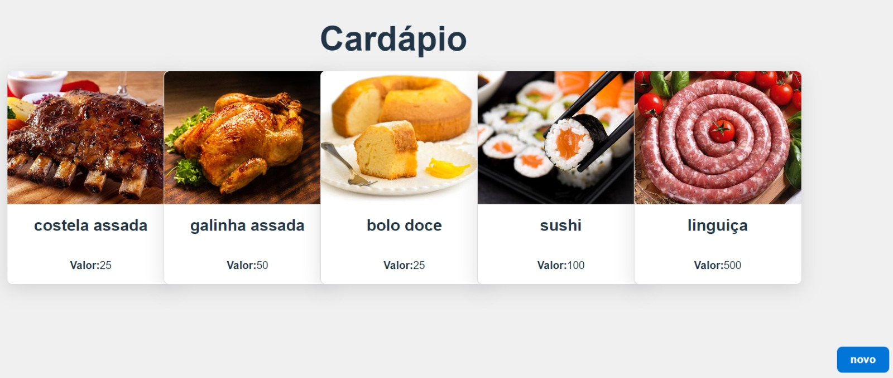
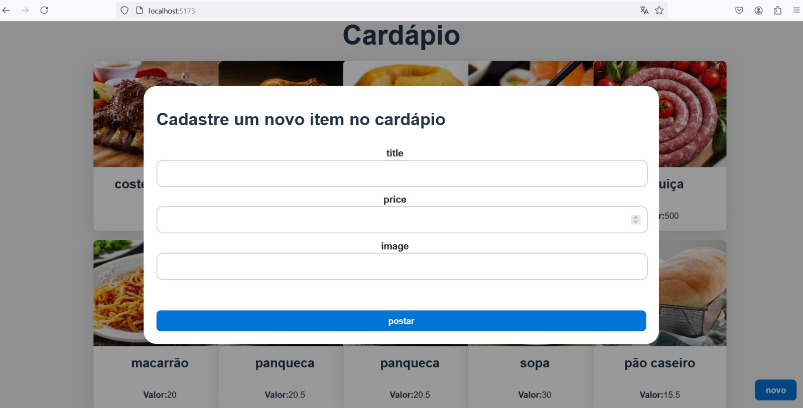
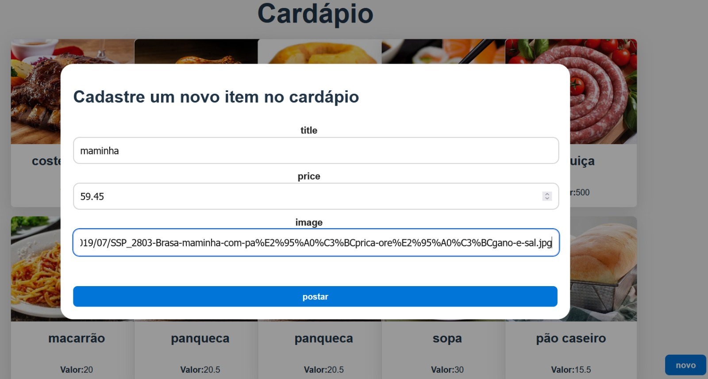
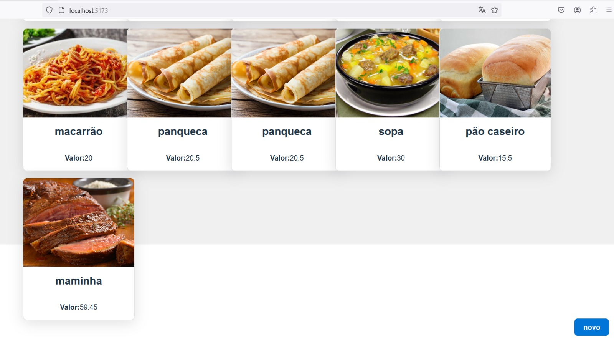

 <p align="center">
   
 
 <h1 align="center">Cardápio</h1>
<p align="center">
</p>


### Description 
---
Crud with spring boot(backed) and typescript(frontend).

---

### Starting
```bash
# Clone this project
$ git clone https://github.com/JenniferFariasRodrigues/cardapio_digital.git

# Access on Eclipse IDE
On IDE choose the option "Import projects". On the folder "General" choose "Existing Projects into workspace" and choose  cardapio_digital tricky-trails-obby folder.

# Choose folder in IDE and run the project
Choose "cardapio_digital" project.
Click on "Run" in the Window.

# Start postgres database on your computer
Choose "Services" on your windows enviroment and click on start postgres sql
# Start backend
Choose cardapio_digital folder. CLick on "run" aplication
#Start frontend
On cardapio folder, put on terminal: npm run dev
#Open the window to show the data
http://localhost:5173/


```

---
### Output

Link:
```
http://localhost:5173/
```


 The expected project frontend output is:
<p align="center">
  
</p>
Click on "novo" button and insert food.<p align="center">
  
</p>
<p align="center">
  
</p>
<p align="center">
  
</p>
